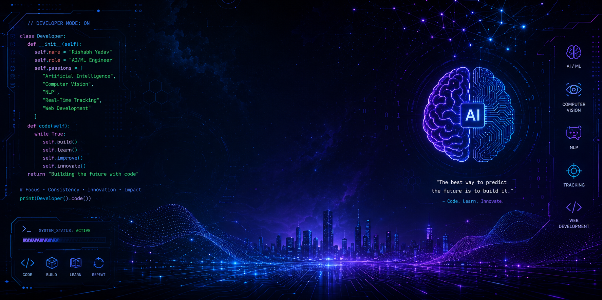

<div align="center">




<br />
<br />

<a href="https://github.com/RishabhYadav123">
  
</a>
<a href="https://www.linkedin.com/in/rishabh-yadav-ba4562288/">
  
</a>
<a href="https://leetcode.com/u/Rishabh_Yadav_17/">
  
</a>

<br />
<br />


</div>

<br />


## 🧠 About Me

<table>
  <tr>
    <td width="58%" valign="top">

```cpp
class RishabhYadav {
public:
    string role = "AI/ML Engineer + Full Stack Developer";
    vector<string> interests = {
        "Artificial Intelligence",
        "Computer Vision",
        "NLP",
        "Real-Time Tracking",
        "Web Development"
    };
    vector<string> currentFocus = {
        "Real-Time Re-identification",
        "YOLOv11 Object Tracking",
        "Accent Intensity Regression",
        "AI Driver Evaluation"
    };
};
```

- 🎓 Final Year **BTech Student** at **PSIT Kanpur**
- 📘 Pursuing **IMSc in Maths and Computing** from **BIT Mesra**
- 🚀 Building intelligent systems around **YOLO, DeepSORT, OpenCV, ML, and real-time analytics**
- 💡 Passionate about combining **AI research + production-grade full-stack apps**
- 🧩 Practicing DSA and problem solving on [LeetCode](https://leetcode.com/u/Rishabh_Yadav_17/)

  </td>
  <td width="42%" valign="top">

<div align="center">


<br />
<br />


</div>

  </td>
  </tr>
</table>


## ⚙️ Tech Stack

<div align="center">

### Core Languages


### Full Stack


### AI, ML And Vision
<br />


</div>

---

## 🔥 Current Projects

<table>
  <tr>
    <td width="50%" valign="top">
      <h3>🎯 Real-Time Re-identification System</h3>
      <p>AI-powered system for identifying and tracking entities across camera streams using computer vision and feature matching.</p>
      <p>
        
        
        
      </p>
    </td>
    <td width="50%" valign="top">
      <h3>📡 YOLOv11 Object Tracking</h3>
      <p>Object detection and tracking workflow focused on real-time inference, motion consistency, and visual analytics.</p>
      <p>
        
        
        
      </p>
    </td>
  </tr>
  <tr>
    <td width="50%" valign="top">
      <h3>🎙️ Accent Intensity Regressor</h3>
      <p>ML model designed to estimate accent intensity using audio/speech features and regression-based prediction.</p>
      <p>
        
        
        
      </p>
    </td>
    <td width="50%" valign="top">
      <h3>🚗 AI-Based Driver Evaluation System</h3>
      <p>Data-driven driver behavior and performance evaluation system with intelligent scoring and decision support.</p>
      <p>
        
        
        
      </p>
    </td>
  </tr>
</table>

---

## 🚀 Featured Projects

<table>
  <tr>
    <td width="50%" valign="top">
      <h3>🛡️ WorkShield</h3>
      <p>Employee attrition prediction and risk analysis platform with ML predictions, CSV workflow, and recommendation outputs.</p>
      <p><b>Stack:</b> Python, Flask, SVM, ML</p>
      <a href="https://github.com/RishabhYadav123/WorkShield">
        
      </a>
    </td>
    <td width="50%" valign="top">
      <h3>🖐️ NexaGestura</h3>
      <p>Gesture-focused project exploring human-computer interaction through intelligent visual recognition workflows.</p>
      <p><b>Stack:</b> Python, Vision, Interaction</p>
      <a href="https://github.com/RishabhYadav123/Nexagestura">
        
      </a>
    </td>
  </tr>
  <tr>
    <td width="50%" valign="top">
      <h3>🎥 RE_identification_Player</h3>
      <p>Player re-identification and tracking project built around real-time computer vision and feature-based matching.</p>
      <p><b>Stack:</b> YOLO, DeepSORT, OpenCV</p>
      <a href="https://github.com/RishabhYadav123/RE_identification_Player">
        
      </a>
    </td>
    <td width="50%" valign="top">
      <h3>🚘 Driver Evaluation System</h3>
      <p>AI and analytics-based system for evaluating driving performance, behavior, and decision quality.</p>
      <p><b>Stack:</b> Python, ML, Data Analysis</p>
      <a href="https://github.com/RishabhYadav123/Driver_Evaluation_System">
        
      </a>
    </td>
  </tr>
</table>

---

## 📊 GitHub Analytics

<div align="center">


<br />
<br />


</div>

---

## 📈 Contribution Graph

<div align="center">


</div>

---

## 🏆 Achievements

<div align="center">


</div>

---

## 🧩 Coding Profile

<div align="center">

<a href="https://leetcode.com/u/Rishabh_Yadav_17/">
  
</a>

</div>

---

## 🐍 Contribution Snake Animation

<div align="center">


</div>

---

## 🌐 Connect With Me

<div align="center">

<a href="https://www.linkedin.com/in/rishabh-yadav-ba4562288/">
  
</a>
<a href="https://leetcode.com/u/Rishabh_Yadav_17/">
  
</a>
<a href="https://github.com/RishabhYadav123">
  
</a>

<br />
<br />


</div>

---

<div align="center">

### ⚡ Building intelligent systems. Shipping clean interfaces. Learning every day.


</div>
